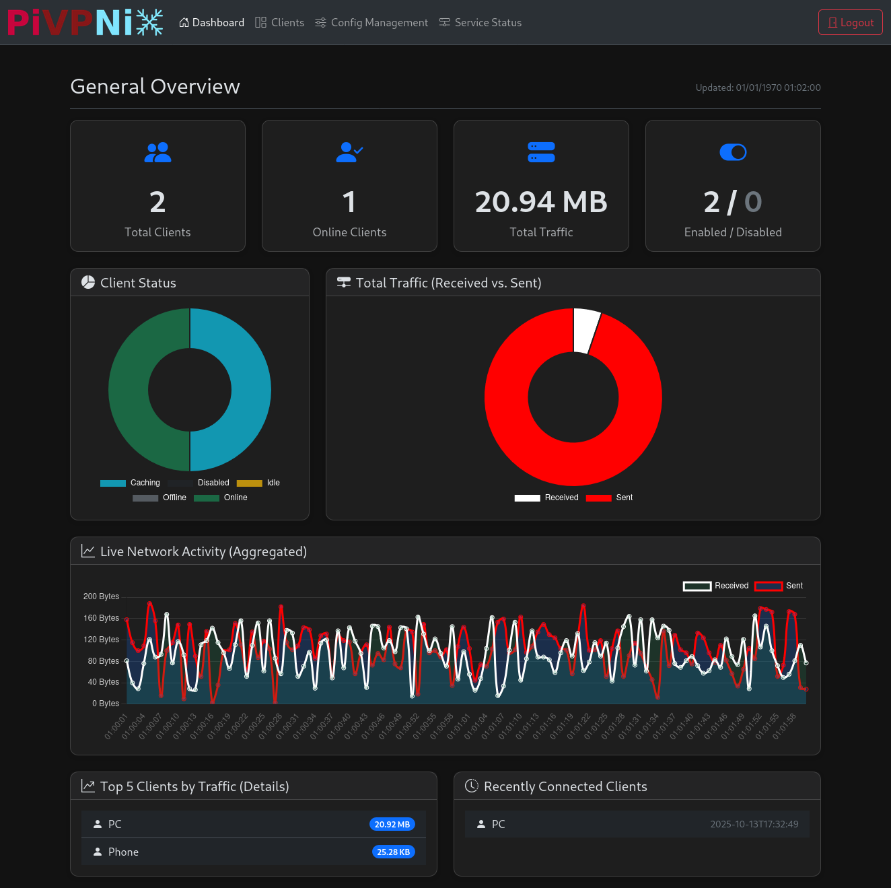
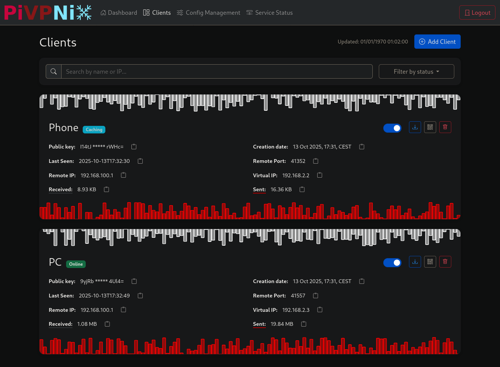
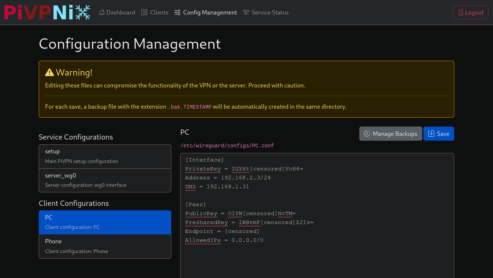
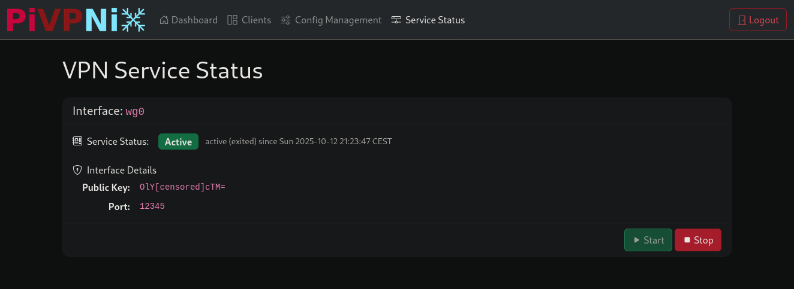

# A Modern Web Interface for PiVPN



**PiVPNix** is a modern, responsive web interface built with Flask to monitor and manage a [PiVPN](https://pivpn.io/) instance running **WireGuard**. It provides a comprehensive dashboard, client management, service status monitoring, and a secure configuration editor.

> [See the guide on how to install Wireguard](./wireguard.md)

---
## ✨ Key Features

*   **📊 Interactive Dashboard**: View real-time statistics, including total/online clients, aggregated traffic, and live network activity graphs.
*   **👥 Client Management**:
    
    *   View all configured clients with their status (Online, Idle, Offline, Disabled).
    *   Add new clients with automatic or manual IP assignment.
    *   Enable or disable clients with a single click.
    *   Revoke (delete) clients permanently.
    *   Download client `.conf` files.
    *   Generate QR codes for easy mobile client setup.
*   **📝 Secure Configuration Editor**:
    
    *   Edit PiVPN and WireGuard configuration files directly in the browser.
    *   Automatic backups are created on every save with a timestamp.
    *   Manage backups: view, restore, or delete old versions.
*   **⚙️ Service Management**: View the status of your WireGuard services (e.g., `wg-quick@wg0`) and start/stop them directly from the web UI.
    
*   **📱 Responsive**: Designed to work on both desktop and mobile devices.

---

## 🚀 Installation (Recommended Method)

PiVPNix includes an automatic installation script to make setup as easy as possible. This is the recommended method for all users.

### Prerequisites

*   A machine (like a Raspberry Pi) with a running instance of [PiVPN](https://pivpn.io/) using WireGuard.
*   Root access (you will need to use the `sudo` command).
*   `git` installed (`sudo apt install git`).

### Installation Steps

1.  **Open a terminal** on your PiVPN server.

2.  **Clone the PiVPNix repository** from GitHub:
    ```bash
    git clone https://github.com/signati5/PiVPNix.git
    ```

3.  **Navigate into the new directory**:
    ```bash
    cd PiVPNix
    ```

4.  **Run the Installer Script**:
    Make the script executable.
    ```bash
    chmod +x install.sh
    ```
    
    Then run it with `sudo`.
    ```bash
    sudo ./install.sh
    ```

The script will handle everything for you! It will:
*   Install all necessary software.
*   Ask you to create a **username** and **password** for the web panel.
*   Ask you to choose a **port** for the web service.
*   Set up a background service so PiVPNix starts automatically when your server boots up.

Once the script is finished, your PiVPNix panel will be running and ready to use!

---

## ⚙️ Managing the PiVPNix Service

The installation script creates a `systemd` service, which means you can easily manage the application like any other system service.

*   **Check the Status of the Service**:
    ```bash
    sudo systemctl status pivpnix
    ```

*   **Stop the Service**:
    ```bash
    sudo systemctl stop pivpnix
    ```

*   **Start the Service**:
    ```bash
    sudo systemctl start pivpnix
    ```

*   **Restart the Service** (after making manual changes, for example):
    ```bash
    sudo systemctl restart pivpnix
    ```

*   **Disable the Service from Starting on Boot**:
    ```bash
    sudo systemctl disable pivpnix
    ```

*   **Enable the Service to Start on Boot Again**:
    ```bash
    sudo systemctl enable pivpnix
    ```

---

## 🔍 Troubleshooting

If the web interface is not accessible or if the service fails to start, the first place to look for errors is the service log.

You can view the latest logs with this command:
```bash
sudo journalctl -u pivpnix.service -n 50 --no-pager
```
*   `-u pivpnix.service`: Shows logs only for the PiVPNix service.
*   `-n 50`: Shows the last 50 lines.
*   `--no-pager`: Prints the logs directly to the console.

If you see Python errors or other issues you can't solve, please **[open an issue](https://github.com/signati5/PiVPNix/issues)** on GitHub and include the log output. We'll be happy to help!

---

## 🗑️ Uninstallation

If you wish to remove PiVPNix from your system, follow these steps:

1.  **Stop and Disable the Service**:
    This stops the application and prevents it from starting on the next boot.
    ```bash
    sudo systemctl stop pivpnix
    sudo systemctl disable pivpnix
    ```

2.  **Remove the Service File**:
    ```bash
    sudo rm /etc/systemd/system/pivpnix.service
    ```

3.  **Reload the Systemd Daemon**:
    This tells the system to forget about the service you just removed.
    ```bash
    sudo systemctl daemon-reload
    ```

4.  **Delete the Application Directory**:
    This will permanently remove all PiVPNix files. **Warning**: This action cannot be undone.
    ```bash
    # Navigate out of the PiVPNix directory first!
    cd ~
    # Remove the directory
    sudo rm -rf /path/to/your/PiVPNix
    ```
    *(Replace `/path/to/your/PiVPNix` with the actual path where you cloned the repository).*

---

## 🛠️ Configuration

For advanced users who want to modify settings after installation, all options are located in the `config.ini` file.

### `[LOG_TRAFFIC_SETTINGS]` section
*   `interval_seconds`: How often the monitor checks traffic.
*   `history_size`: How many data points are stored for charts.
*   `idle_for_size` / `not_conn_for_size`: Rules for determining client status based on inactivity.

### `[FLASK_SETTINGS]` section
*   `SECRET_KEY`, `USERNAME`, `PASSWORD`: Security credentials for the web panel.

To generate a new, secure `SECRET_KEY`, you can run this command in your terminal:
```bash
python3 -c 'import secrets; print(secrets.token_hex(32))'
```
or this:
```bash
openssl rand -hex 32
```

Copy the output and replace the existing `SECRET_KEY` value in `config.ini`. Remember to restart the service (`sudo systemctl restart pivpnix`) after any changes.
