# 🛡️ Complete Guide to Installing WireGuard on Raspberry Pi with PiVPN

Welcome! This guide will walk you through the step-by-step process of setting up a personal, secure VPN server on your Raspberry Pi. We will use **WireGuard**, a modern, fast, and secure VPN protocol, and **PiVPN**, a brilliant script that makes the entire process incredibly simple.

Having a home VPN allows you to:
*   **Browse securely** when connected to public Wi-Fi networks (airports, hotels, cafes).
*   **Access files and devices on your home network** (like a NAS, printer, or other computers) from anywhere in the world.
*   **Maintain your online privacy** by masking your internet traffic.

Let's get started!

## ✅ Essential Requirements

Before you begin, make sure you have everything you need:

*   **Raspberry Pi**: Any model will work, as long as it has an updated version of Raspberry Pi OS (or another Debian-based distribution).
*   **Stable Internet Connection**: The Raspberry Pi must be connected to the internet, preferably via an Ethernet cable for maximum stability.
*   **Terminal Access**: You will need to send commands to your Raspberry Pi, either directly with a keyboard and monitor or more conveniently via **SSH** from another computer.
*   **Static IP for the Raspberry Pi**: It is crucial that your Raspberry Pi has an IP address on your local network that never changes. You can achieve this through **DHCP Reservation** on your router (recommended) or by setting it up manually. This ensures that external connections are always routed to the correct device.
*   **Sudo Access**: You must have a user with administrative privileges (`sudo`).

## 1. 🧑‍🔧 Create a Dedicated User (Optional but Recommended)
For enhanced security, it is good practice not to run services with the main user (`pi`). Let's create a dedicated user exclusively for managing the VPN.

```bash
sudo adduser wireguard
```
The system will ask you to set a password for the new user. Enter a strong password and then press `ENTER` to skip the other informational fields (Full Name, etc.).

## 2. ⬇️ Install PiVPN
Now, let's install PiVPN. This genius script will do almost all the work for us. Run this single command in the terminal:
```bash
curl -L https://install.pivpn.io | bash
```
This command downloads the official installation script and executes it, starting a text-based setup wizard.

## 3. 🖼️ The Installation Wizard
You will see a series of screens. Don't worry, I'll guide you through each choice.

### ➤ Introduction
The first screen welcomes you and informs you that PiVPN is an installer for VPN servers.
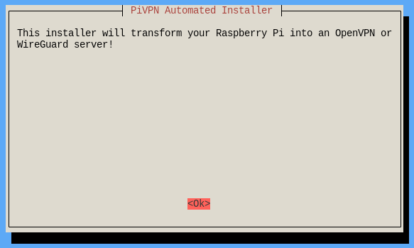

### ➤ Static IP Setup
PiVPN reminds you that it needs a static IP address to function correctly.
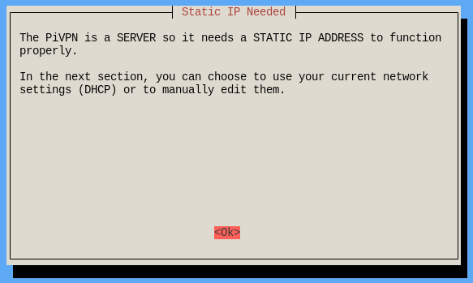

### ➤ DHCP Reservation or Manual Static IP
This is an important choice.
*   **DHCP Reservation (Recommended)**: If you have already configured your router to always assign the same IP to your Raspberry Pi, select **Yes**. This is the best solution because management is centralized on your router.
*   **Manual Static IP**: If you don't have access to your router or don't want to use DHCP Reservation, select **No**. PiVPN will configure the static IP directly on the Raspberry Pi.
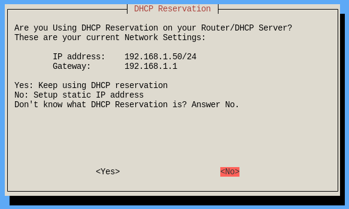
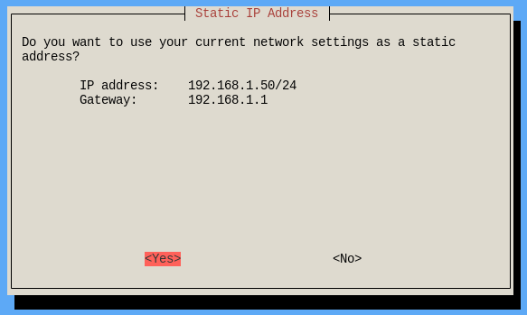
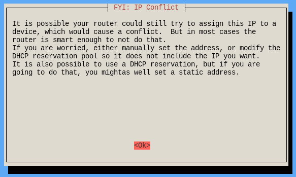

## 4. 👤 Choose a User
PiVPN will ask you which local user should manage the VPN configurations. If you created the `wireguard` user in the first step, select it from the list. Otherwise, you can use the `pi` user.
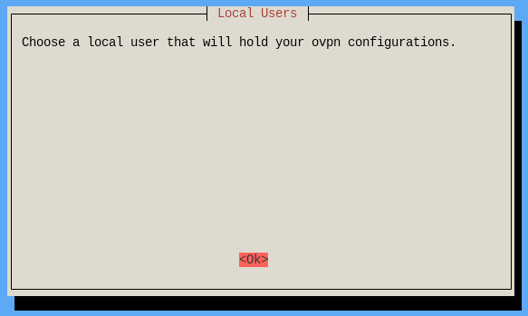
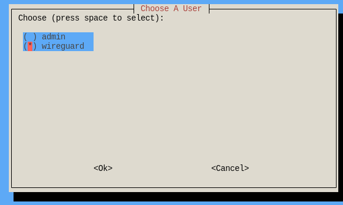

## 5. 🔒 Choose the VPN Protocol
PiVPN can install either WireGuard or OpenVPN. We will choose **WireGuard** for its modernity, speed, and simplicity.


## 6. 🌐 Choose the VPN Port
The standard port for WireGuard is `51820`. It is advisable to keep this port unless you have a specific reason to change it (e.g., network restrictions). Press `ENTER` to confirm the default port.
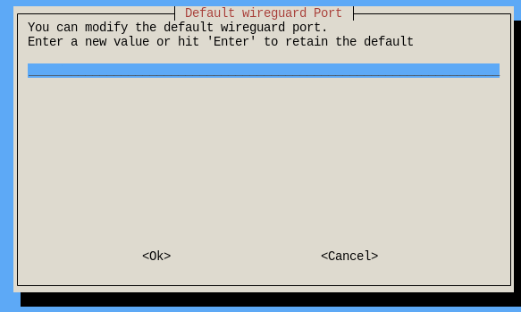

## 7. 📡 Configure the DNS Provider
When you are connected to the VPN, your devices need a DNS server to translate website names (e.g., `google.com`) into IP addresses. You have several options:
*   **Google, Cloudflare, Quad9, etc.**: These are excellent, fast, and reliable choices.
*   **Custom**: If you use a custom DNS server (like Pi-hole), you can enter its IP address here.
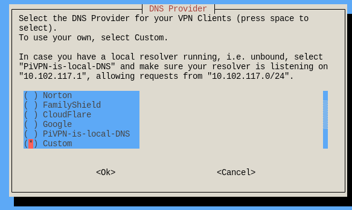
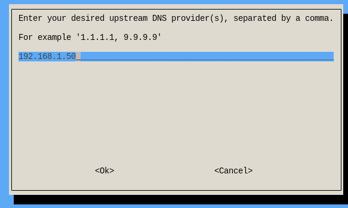

## 8. 🌍 Access via Public IP or Hostname
The script will ask how your clients (phone, laptop) should connect to the server.
*   **Use this public IP**: Uses the current public IP address of your network. This is fine if your IP address doesn't change often.
*   **Use a public DNS Entry**: **Recommended choice**. If you have a dynamic DNS service (like No-IP or DuckDNS), you can enter your hostname here (e.g., `myvpn.ddns.net`). This ensures the connection will work even if your public IP changes. We will cover this in more detail later.
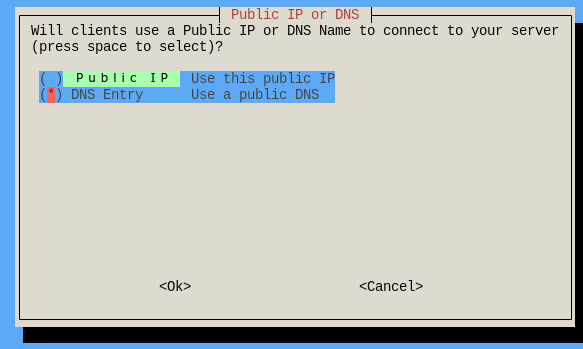
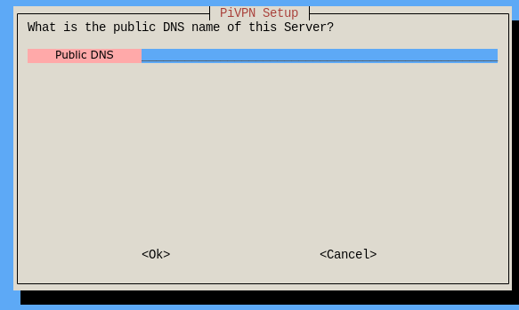

## 9. 🔄 Unattended Security Upgrades
You will be asked if you want to enable "unattended upgrades." This allows your Raspberry Pi to automatically install security updates. This is a **strongly recommended** practice, so select **Yes**.
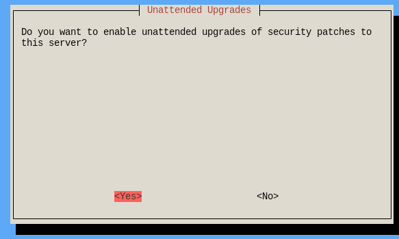

The installation will now proceed and, at the end, it will ask you to reboot. Do so.

## 10. 🧪 Verify the Installation
After the reboot, open the terminal again and verify that the WireGuard network interface is active:
```bash
ip a
```
Scroll through the list, and you should see a new interface called `wg0`. This confirms that the WireGuard server is running!

## 11. ➕ Add a New Client (Peer)
A "client" (or "peer") is a device that will connect to your VPN (your smartphone, your laptop, etc.). For each device, you must create a separate configuration profile.

Run the command:
```bash
pivpn add
```
You will be asked to enter a name for the client. Choose a descriptive name, for example, `marks_phone` or `work_laptop`.

PiVPN will generate two things for you:
*   A **`.conf` file**: This text file contains all the necessary settings for the client. You will find it in the `/home/<user>/configs/` directory.
*   A **QR Code**: Displayed directly in the terminal, it is perfect for setting up the WireGuard app on your smartphone in seconds.

## 12. 🌐 Configure Port Forwarding
This is a crucial step. You must tell your home router to forward all incoming traffic on the WireGuard port to your Raspberry Pi.
Think of port forwarding like a switchboard operator: when a "call" comes in on port 51820, the operator (your router) knows to transfer it to extension 31 (the IP of your Raspberry Pi).

1.  Log in to your router's web interface (usually at an address like `192.168.1.1` or `192.168.0.1`).
2.  Look for a section called **"Port Forwarding,"** "Virtual Server," or a similar name.
3.  Create a new rule with these settings:
    *   **External Port (or WAN Port)**: `51820`
    *   **Internal Port (or LAN Port)**: `51820`
    *   **Internal IP Address (or Server IP)**: The static IP of your Raspberry Pi (e.g., `192.168.1.31`).
    *   **Protocol**: **UDP** (not TCP!)
4.  Save and apply the rule.

## 13. 🌐 IP Routing (Accessing Your Local Network)
By default, clients connected to the VPN can browse the internet securely, but they cannot "see" other devices on your home network (like a NAS or a printer). To enable this functionality, we need to turn the Raspberry Pi into a mini-router.

### ➤ Enable IP Forwarding
We need to tell the Linux operating system to allow the forwarding of network packets.
```bash
sudo nano /etc/sysctl.conf
```
A text editor will open. Use the arrow keys to find the line `#net.ipv4.ip_forward=1`. Remove the `#` character at the beginning to "uncomment" it:
```
net.ipv4.ip_forward=1
```
Save the file by pressing `CTRL+O`, then `ENTER`, and finally exit with `CTRL+X`.
Apply the change immediately with this command:
```bash
sudo sysctl -p
```

### ➤ Configure the Firewall (iptables)

Now we need to configure the firewall so that devices connected through the VPN can communicate properly with your local network and the internet.
Essentially, we’ll make the Raspberry Pi act as a small router by allowing **packet forwarding** and enabling **NAT (Network Address Translation)** — so that all VPN traffic appears to come from the Pi’s own IP address.

Run the following commands one by one:

#### 1️1. Enable NAT (Masquerading)

```bash
sudo iptables -t nat -A POSTROUTING -s 10.6.0.0/24 -o eth0 -j MASQUERADE
```

**What it does:**
This rule applies **Network Address Translation (NAT)** to all packets coming from the VPN subnet (`10.6.0.0/24`) and going out through the Pi’s main network interface (`eth0`).
It “masquerades” the source IP addresses meaning that when a VPN client (e.g., `10.6.0.2`) sends traffic to the internet or your LAN, the router only sees the Raspberry Pi’s IP address, not the client’s.

**In other words:**
The Raspberry Pi becomes a “middleman” that hides all VPN clients behind its own IP — just like how your home router lets many devices share one public IP.

#### 2️2. Allow Forwarding from VPN to LAN/Internet

```bash
sudo iptables -A FORWARD -i wg0 -o eth0 -j ACCEPT
```

**What it does:**
This rule allows traffic that **enters from the VPN interface (`wg0`)** to be **forwarded to your local network or the internet** through the main interface (`eth0`).

**In other words:**
When a device connected to the VPN tries to access a website or a device on your home network, this rule lets the traffic pass through the Raspberry Pi instead of being blocked.

#### 3️3. Allow Forwarding from LAN/Internet back to VPN

```bash
sudo iptables -A FORWARD -i eth0 -o wg0 -j ACCEPT
```

**What it does:**
This rule allows traffic in the **opposite direction** — from your local network (or internet) back to the VPN clients.

**In other words:**
It ensures that devices on your home network can respond to requests from VPN clients, and that replies to VPN traffic can flow back correctly.

### ⚙️ Notes

* Replace `10.6.0.0/24` with your VPN’s subnet if you changed it during installation.
* Replace `eth0` with the name of your main network interface (for example, `wlan0` if your Raspberry Pi connects via Wi-Fi).
  You can find it with:

  ```bash
  ip add
  ```

### 💾 Make the Rules Persistent

By default, these rules will disappear after a reboot.
To make them permanent, install and save them with:

```bash
sudo netfilter-persistent save
```

From now on, your Raspberry Pi will automatically load these firewall settings at startup, ensuring that VPN traffic is properly routed and masqueraded every time.

## 14. 📡 Verify the Connection with `ping`
Now that everything is configured, let's test that the communication works correctly.

### ➤ Test 1: From your PC on the local network to your Phone connected via VPN
1.  Disconnect your smartphone from your home Wi-Fi and connect using your mobile data network.
2.  Activate the VPN connection on your phone using the QR code generated earlier.
3.  In the WireGuard app on your phone, you will see the IP assigned to the client (e.g., `10.6.0.2`).
4.  From the terminal of your PC (which is on your home network), run the ping command:
    ```bash
    ping 10.6.0.2
    ```
If you see replies, fantastic! Your PC can "see" your phone through the VPN.

### ➤ Test 2: From your Phone on VPN to your PC on the local network
This is the most important test to verify LAN access.
1.  Find the local IP address of your PC (e.g., `192.168.1.50`).
2.  On your phone (still connected to the VPN), use a terminal app (like **Termux** for Android) and ping your PC:
    ```bash
    ping 192.168.1.50
    ```
If you receive replies, it means IP routing is working perfectly, and you can reach devices on your home network from the VPN!

## 15. 📲 Dynamic DNS Service (DDNS)
The public IP address of your home internet connection (the one your ISP assigns you) can change. If it changes, your VPN will stop working because your clients will no longer know which address to connect to.

A **Dynamic DNS (DDNS)** service solves this problem: it gives you a fixed domain name (e.g., `myvpn.ddns.net`) that always points to your public IP, even when it changes.

### ➤ Register a Free Hostname
Sign up with one of these services and create a hostname:
*   [No-IP](https://www.noip.com/)
*   [DuckDNS](https://www.duckdns.org/)

### ➤ Install the Update Client on the Raspberry Pi
Each service has its own small piece of software (a client) that you need to install on your Raspberry Pi. This client will periodically communicate your current public IP to the DDNS service. Follow the official guides of the service you chose to install it.

### ➤ Update the WireGuard Client Configuration
Once you have your DDNS hostname, open your client's `.conf` file and edit the `Endpoint` line:
```ini
[Peer]
...
Endpoint = myvpn.ddns.net:51820
```
Replace the public IP address with your new hostname. This way, your client will always connect to the right address.

## ✅ Conclusion
Congratulations! You have successfully installed and configured a **WireGuard** VPN server on your Raspberry Pi using **PiVPN**. You now have a powerful and versatile tool to:
*   Protect your privacy and security online.
*   Securely access your home network from anywhere.
*   Make the most of your Raspberry Pi's capabilities.

Happy secure browsing
